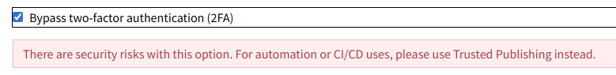

# 项目创建流程

## 1. 创建发布项目

- mkdir s-cli-dev
- cd s-cli-dev
- npm init -y
- npm install -g lerna // 注意：没有全局安装 lerna 的话，需要这样创建 packages: npx lerna create @s-cli-dev/log
- lerna init
- 在根目录的 package.json 中添加(看你的包的路径)：

  "workspaces": [
  "core/*",
  "utils/*"
  ]

- 创建 packages:
  (1) lerna create cli
  (2) lerna create utils
- 软链接：
  在 cli 中的 package.json 添加：
  "dependencies": {
  "@s-cli-dev/utils": "^1.0.5" // 加上^，表示安装最新版本的 utils
  },
  然后回到根目录 npm install
  即可在 cli 中软链接到 utils(注意： utils 中的 package.json 中的 name 必须是: @s-cli-dev/utils)

- lerna version 可以修改版本
- lerna publish 发布 package
  注意 1：发布之前需要先登录 npm login，同时因为包名为@开头，属于私有包，所以需要在每个 package 中的 package.json 添加：
  "publishConfig": {
  "access": "public"
  },
  另外，需要去 npmjs.com 上创建一个 Organizations，然后发布上去

  注意：发布的话没有 LICENSE.md 会报错，需要手动添加

每次发布后，lerna 会在 github 上打个 tag

** 因为 workspace 的依赖结构是扁平化 (hoisted) 的
** 1. cli 中安装的第三方依赖都会放到根目录 node_modules
** 2. cli、utils 等子包默认没有 node_modules
** 3. workspace 会自动为每个子包建立软链接，让它们都能访问依赖
** 只要本地 workspace cli 的依赖会继续指向本地 utils 包，而不是发布到 npm 上的 utils 包
** 发布后，cli 的依赖会指向发布到 npm 上的 utils 包
** 工作区优先级 > 线上版本
** nvm 切换 node 版本时，需要重新安装依赖和注册命令(s-cli)

## 2. 一些注意事项

- 2.1 给子包安装依赖(举例：npmlog)：

  - 给 utils 安装依赖：npm install npmlog -w @s-cli-dev/log
  - 给 cli 安装依赖：npm install npmlog -w @s-cli-dev/cli

- 2.2 批量安装(npmlog)：

  - 安装 npmlog 到所有 utils/_ 子包：npm install npmlog@^7.0.1 -w utils/_
  - 如果也想加到 cli/_ 子包：npm install npmlog@^7.0.1 -w cli/_

- 2.3 关于是否需要在子包的 package.json 里申明依赖

  - workspace 使用的是 hoist（默认行为），子包运行时即使不安装用到的依赖，直接在根目录安装依赖，子包也能用，但是 package.json 里明确列依赖更安全，CI、打包、发布都会依赖这些声明

- 2.4 查看 s-cli 软连接地址：Get-Command s-cli | Select-Object Source

- 2.5 s-cli 软连接到 cli 包： npm link @s-cli-dev/cli

## 3. 新增一个子包（有个小坑）

- npx lerna create @s-cli-dev/example
- 在 @s-cli-dev/example 中安装依赖：npm install npmlog -w @s-cli-dev/example
- 第一次执行 npm install npmlog -w @s-cli-dev/example 的时候会出现一个问题：npm warn workspaces @s-cli-dev/example in filter set, but no workspace folder present
- 第二次执行就能成功安装上(成功的话 package.json 中会有 npmlog 的依赖)
- 出现上面这个问题的原因：
  - 第一次执行 npm install npmlog -w @s-cli-dev/example 的时候，npm 会去查找@s-cli-dev/example 这个 workspace 是否存在
  - 因为@s-cli-dev/example 刚创建， workspace 还不存在，所以会报错，但是因为执行了一次 npm install，这个时候根目录的 node_modules 中会出现@s-cli-dev/example
  - 第二次执行 npm install npmlog -w @s-cli-dev/example 的时候，npm 会去查找@s-cli-dev/example 这个 workspace 是否存在
  - 由于前面已经安装了@s-cli-dev/example ，所以这个 workspace 已经存在了，所以不会报错，成功安装 npmlog 到@s-cli-dev/example 中
- 所以当新增一个包时，最好先 npm install 一次（但是我觉得不应该这么麻烦，找找解决方案）

## 4. 发布踩坑

- 4.1 发布命令： lerna publish
  发布之前有修改的话要先提交到 git 上
- 4.2 遇到的 403 错误：

  ```
  lerna WARN notice Package failed to publish: @s-cli-dev/utils
  lerna ERR! E403 Two-factor authentication or granular access token with bypass 2fa enabled is required to publish packages.
  lerna ERR! errno "undefined" is not a valid exit code - exiting with code 1
  lerna WARN notice Package failed to publish: @s-cli-dev/init
  lerna ERR! E403 Two-factor authentication or granular access token with bypass 2fa enabled is required to publish packages.
  lerna ERR! errno "undefined" is not a valid exit code - exiting with code 1
  ```

  原因： 因为 npm 发布需要开启 2fa 验证，所以需要在 npm 上开启 2fa 验证
  解决方法：

  - 4.2.1 登录 npm 官网 → Account Settings → Access Tokens → Generate New Token。
  - 4.2.2 选择 Automation 类型的 token，这种 token 可以 bypass 2FA 验证
  - 4.2.3 复制生成的 token，本地创建 .npmrc 文件，添加：
    ```
    //registry.npmjs.org/:_authToken=YOUR_TOKEN
    ```
  - 4.2.4 重新执行发布命令： lerna publish

  注意：生成 token 的时候要勾选这个
  
